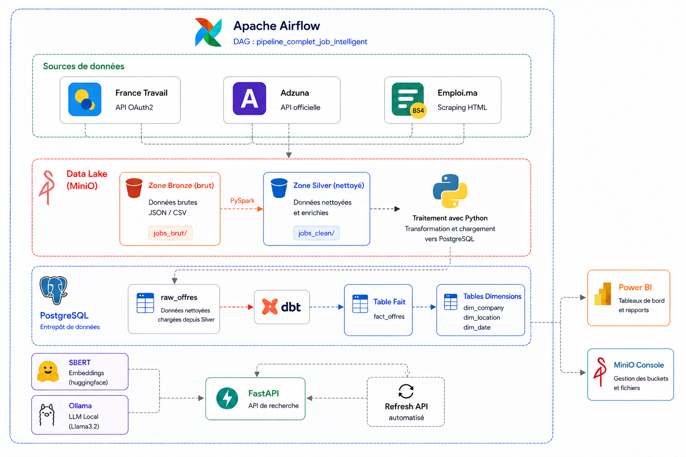
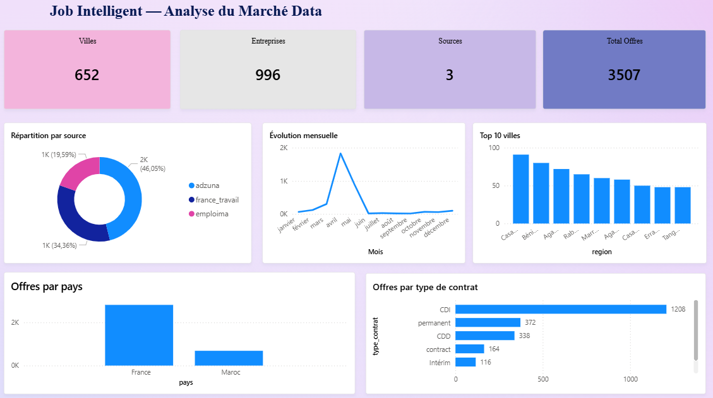
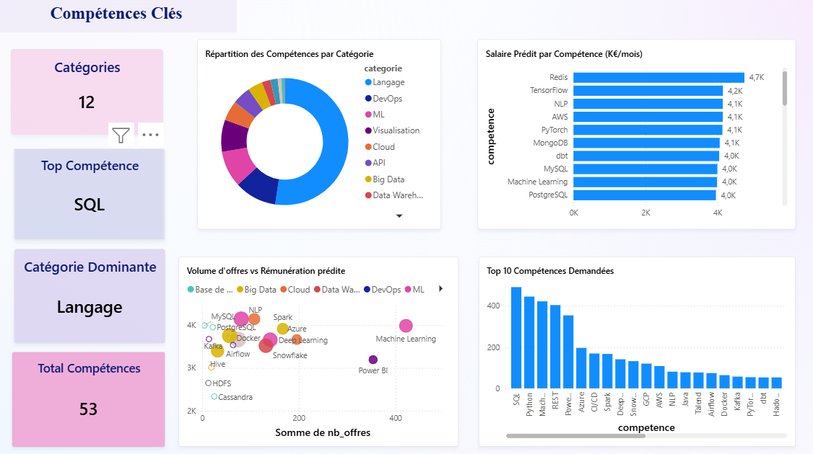
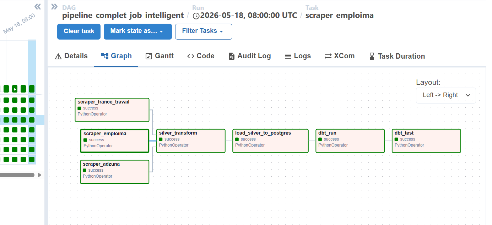

# 🧠 Job Intelligent
> Plateforme de centralisation et de recommandation d'offres d'emploi Data


---

## 📌 Présentation

**Job Intelligent** est un projet d'examen final en Data Engineering & Power BI.  
L'objectif : centraliser les offres d'emploi dans le domaine de la Data (Engineer, Scientist, Analyst, ML Engineer…) depuis plusieurs sources, les transformer via un pipeline industriel complet, et recommander les meilleures offres à un candidat à partir de son CV grâce au **NLP (Sentence-BERT)**.

Le projet intègre également un **modèle ML de prédiction salariale** (GradientBoosting) pour estimer les salaires des 83% d'offres qui ne les affichent pas.

---

## 🖼️ Aperçu
### Architecture Globale du Pipeline

### Dashboard Power BI — Analyse du Marché Data


### Dashboard Power BI — Compétences Clés & Salaires Prédits


### Interface FastAPI — Recommandation CV


### DAG Airflow — Pipeline quotidien


---

## 🛠️ Stack Technique

| Composant | Outil | Rôle |
|---|---|---|
| Langage | Python 3.11 | Développement principal |
| Orchestration | Apache Airflow 2.9.0 | Planification des pipelines |
| Traitement | Apache Spark 3.5.1 | Transformation distribuée |
| Data Lake | MinIO | Stockage Bronze / Silver / Gold |
| Data Warehouse | PostgreSQL 15 | Stockage structuré (schéma étoile) |
| Interface DB | pgAdmin 4 | Administration PostgreSQL |
| Transformation SQL | dbt 1.7 | Modèles SQL versionnés |
| NLP / ML | Sentence-BERT + sklearn | Recommandation + prédiction salariale |
| Visualisation | Power BI | Dashboards analytiques |
| API | FastAPI | 13 endpoints REST |
| Conteneurs | Docker Compose | Environnement reproductible |

---

## 🐳 Infrastructure Docker (8 conteneurs)

| Service | Port externe | Statut |
|---|---|---|
| PostgreSQL 15 | 5433 | ✅ Running |
| pgAdmin 4 | 5050 | ✅ Running |
| Apache Airflow 2.9 | 8082 | ✅ Running |
| Spark Master UI | 8083 | ✅ Running |
| Spark Master | 7077 | ✅ Running |
| MinIO API | 9002 | ✅ Running |
| MinIO Console | 9003 | ✅ Running |
| FastAPI NLP | 8000 | ✅ Running |

---

## 📊 Sources de Données

| Source | Méthode | Offres collectées |
|---|---|---|
| France Travail | API OAuth2 officielle | 778 offres |
| Adzuna | API officielle | 904 offres |
| Emploi.ma | Scraping HTML (BeautifulSoup4) | 74 offres |
| **TOTAL** | | **1 756 offres** |

**Profils collectés :** Data Engineer · Data Scientist · Data Analyst · ML Engineer · Business Intelligence · Data Architect

---

## 🗄️ Data Warehouse — Schéma en Étoile

Base : `dwh_job_intelligent` (PostgreSQL 15, port 5433)

| Table | Lignes | Description |
|---|---|---|
| `fact_offres` | ~2 868 | Table de faits principale |
| `dim_date` | 178 | Dimension temporelle |
| `dim_entreprise` | 842 | Dimension entreprise |
| `dim_lieu` | 528 | Dimension géographique |
| `dim_competence` | 52 | Dimension compétences |
| `raw_offres` | 1 756 | Données brutes (22 colonnes) |

---

## 🤖 Phase 4 — NLP & Machine Learning

### Moteur de Recommandation (Sentence-BERT)
- Modèle : `paraphrase-multilingual-MiniLM-L12-v2` (FR + EN)
- Extraction du CV via `pdfplumber`
- Vectorisation de **2 868 offres** avec similarité cosinus
- Refresh incrémental des vecteurs (évite la re-vectorisation complète de 6 min)
- Explication RAG via Ollama / Llama3.2

### Modèle ML Salarial (GradientBoosting)
- **MAE : 871 €/mois** · **R² : 0.29**
- Features : TF-IDF (titre + description) + OneHotEncoder (pays, contrat, secteur) + binaires (is_senior, is_junior)
- Prédit le salaire des **83% d'offres sans information salariale**
- Cross-validation 5-fold

---

## ⚡ API FastAPI — 13 Endpoints

| Route | Description |
|---|---|
| `GET /` | Interface HTML candidat |
| `GET /api/health` | Statut API + nb offres vectorisées |
| `GET /api/stats` | Statistiques marché emploi |
| `POST /api/candidat/inscription` | Upload CV + création profil |
| `GET /api/candidat/{email}` | Récupérer profil candidat |
| `GET /api/recommandations/{email}` | Top 10 offres matchées |
| `POST /api/recommandations/cv-direct` | Recommandations sans inscription |
| `POST /api/refresh-vectors` | Refresh incrémental des vecteurs |
| `GET /api/salary/status` | Statut + métriques du modèle ML |
| `POST /api/salary/train` | Entraîner / ré-entraîner le modèle |
| `POST /api/salary/predict` | Prédire salaire (JSON complet) |
| `GET /api/salary/predict-quick` | Prédiction rapide par titre |
| `POST /api/salary/export-gold` | Exporter prédictions → MinIO Gold |

---

## 🔄 Pipeline DAG Airflow

```
[france_travail] ─┐
[adzuna]          ─┼→ [silver_transform] → [load_postgres] → [dbt_run] → [dbt_test] → [refresh_api_vectors]
[emploima]        ─┘
```

Schedule : `0 8 * * *` — exécution quotidienne à 08h00

---

## 📁 Structure du Projet

```
job-intelligent/
├── docker-compose.yml          ← Infrastructure complète
├── .env                        ← Variables d'environnement (non versionné)
├── src/
│   ├── etl/
│   │   ├── dag_pipeline_complet.py     ← DAG Airflow principal
│   │   ├── load_silver_to_postgres.py  ← Chargement Silver → PostgreSQL
│   │   └── scrapers/                   ← France Travail, Adzuna, Emploi.ma
│   ├── api/
│   │   ├── main.py                     ← FastAPI + enrichissement salaire
│   │   ├── nlp_engine.py               ← Sentence-BERT + cosinus
│   │   ├── salary_predictor.py         ← Modèle GradientBoosting
│   │   ├── salary_routes.py            ← Endpoints /api/salary/*
│   │   ├── db.py                       ← Connexions PostgreSQL
│   │   ├── index.html                  ← Interface HTML 4 onglets
│   │   ├── Dockerfile
│   │   └── cache/                      ← Vecteurs + modèles sérialisés
│   └── ml/
│       └── salary_predictor.py
├── dbt/
│   └── models/
│       ├── staging/stg_offres.sql
│       └── marts/
│           ├── dim_date.sql
│           ├── dim_lieu.sql
│           ├── dim_entreprise.sql
│           └── fact_offres.sql         ← Mode incrémental
├── sql/                                ← Vues et scripts PostgreSQL
├── dashboards/                         ← Fichiers Power BI (.pbix)
└── docs/
    └── screenshots/                    ← Captures d'écran du projet
```

---

## 🚀 Démarrage Rapide

### Prérequis
- Docker Desktop installé
- 8 Go RAM minimum recommandés

### Lancement

```bash
# 1. Cloner le repo
git clone https://github.com/Yousra-khallou/job-intelligent.git
cd job-intelligent

# 2. Configurer les variables d'environnement
cp .env.example .env
# Éditer .env avec vos clés API France Travail et Adzuna

# 3. Démarrer tous les services
docker-compose up -d

# 4. Vérifier que tout tourne
docker ps
```

### Accès aux interfaces

| Interface | URL |
|---|---|
| Airflow | http://localhost:8082 |
| MinIO Console | http://localhost:9003 |
| pgAdmin | http://localhost:5050 |
| Spark UI | http://localhost:8083 |
| FastAPI | http://localhost:8000 |

### Connexion Power BI

```
Server   : localhost
Port     : 5433
Database : dwh_job_intelligent
Username : admin
Password : admin123
```

---

## 📈 Chiffres Clés

| Métrique | Valeur |
|---|---|
| Offres collectées | 1 756 |
| Offres dans fact_offres | ~2 868 |
| Offres vectorisées (NLP) | 2 868 |
| Compétences détectées | 52 (12 catégories) |
| MAE modèle salarial | 871 €/mois |
| Conteneurs Docker | 8 |
| Modèles dbt | 5 |
| Fichiers Gold MinIO | 6 |
| Endpoints FastAPI | 13 |

---

## 👩‍💻 Auteure

**Khallou Yousra** — Élève Ingénieure Data Engineering  
Examen Final Data Engineering & Power BI | Mars 2026

---

*Note : Les fichiers `.env`, `cache/`, `dbt/target/` et `dbt/logs/` ne sont pas versionnés.*
